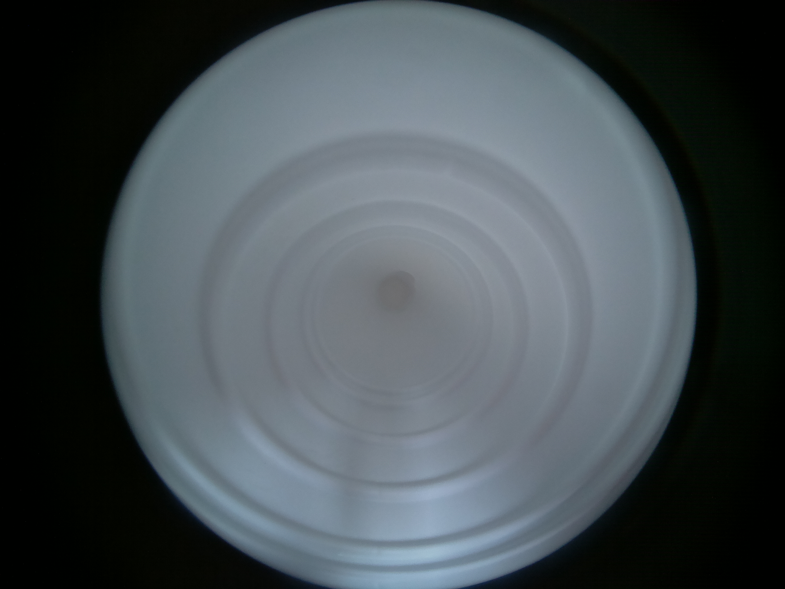

# Centering

## 1. Purpose

The centers of images of every fisheye cameras are a little different. To automatically find 
the location of the image center, we do the following steps,

1.1. Make upper and lower borders

1.2. Turn to grayscale image

1.3. Adjust brightness and contrast

1.4. Gaussian Blur

1.5. Apply the Hough Transform to find the circle

